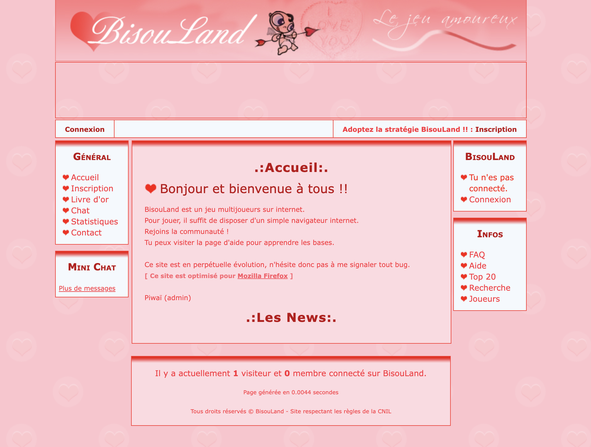

# SkySwoon (Bisouland)

SkySwoon (originally Bisouland) is a free browser-based strategy game that turns
romance into competitive gameplay.

Join other players online as you strategically send **Kisses** to capture
**Love Points** and dominate the clouds.

Simple to learn, engaging to master, and completely free to play.

A delightfully retro online strategy game from 2005, lovingly preserved in its
original state. Experience a fascinating time capsule of early web development
and quirky game design.



## Installation

To install SkySwoon, first get its sources:

```console
git clone git://github.com/pyricau/bisouland.git skyswoon
cd skyswoon
```

The `apps` folder contains the different applications:

* [Monolith](./apps/monolith/README.md):
  the main (original) SkySwoon / Bisouland application

## Further documentation

You can find more documentation at the following links:

* legal terms (Apache 2): [LICENSE](LICENSE)
* records of version changes: [CHANGELOG.md](CHANGELOG.md)
* contribution instructions: [CONTRIBUTING.md](CONTRIBUTING.md)

## Project history

* 2025: roll back to version 1, again; now version 4
* 2013: roll back to the version 1, which becomes the version 3
* 2012: release of the version 2
* 2011: Open-sourcing of the project, new team to take over the project with
  Marc Epron, Thomas Gay and Loïc Faugeron
* 2005: creation of the project by **Pierre-Yves Ricau**
