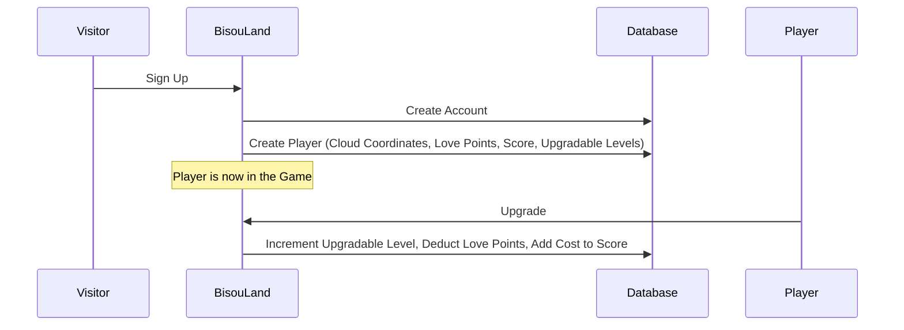

# Game

Once a **Player** has **Signed Up**, they are placed on a **Cloud**
at a **Fluffy Spot** (cloud coordinates X/Y).

They start with **300 Love Points**, a **Score** of 0,
and initial **Upgradable Levels** (Heart and Mouth at 1, everything else at 0).

A **Player** can spend **Love Points** to **Upgrade** their **Organs**,
**Bisous** and **Techniques**.

Each **Upgradable** has a cost (exponential for Organs and Techniques,
flat for Bisous) and **Prerequisites** that must be met before upgrading.

## Flow Diagram

## Ubiquitous Dictionary

| Term              | Type   | Definition                                                                     |
|-------------------|--------|--------------------------------------------------------------------------------|
| Player            | Model  | A registered player with cloud coordinates, love points, score, and levels     |
| Cloud Coordinates | Model  | A player's position: X (cloud number, starts at 1) and Y (fluffy spot, 1-16)   |
| Love Points       | Model  | Currency for upgrades, starts at 300                                           |
| Score             | Model  | Accumulated by adding the cost of each upgrade, starts at 0                    |
| Upgradable Levels | Model  | Current level for each upgradables                                             |
| Upgradable        | Model  | An organ, bisou, or technique that can be upgraded                             |
| Sign Up           | Action | Creates an Account and a Player with auto-assigned cloud coordinates           |
| Upgrade           | Action | Spends love points to increment an upgradable level, adding the cost to score  |

## Cloud Placement

Players are placed on clouds:

* **X** (cloud number): starts at 1, a new cloud is created when the current one is full
* **Y** (fluffy spot): 1 to 16, max 9 players per cloud

## Upgradables

There are 14 upgradables split into three categories:

| Category   | Upgradables                                      | Cost Model  |
|------------|--------------------------------------------------|-------------|
| Organs     | Heart, Mouth, Tongue, Teeth, Legs, Eyes          | Exponential |
| Bisous     | Peck, Smooch, French Kiss                        | Flat        |
| Techniques | Hold Breath, Flirt, Spit, Leap, Soup             | Exponential |

Organs and Techniques use an exponential cost formula: `ceil(base * exp(rate * level))`.
Bisous have flat costs (800, 3500, 10000).

Upgradables can have **Prerequisites** (eg Mouth requires Heart >= 2,
French Kiss requires Tongue >= 5 AND Mouth >= 10).
