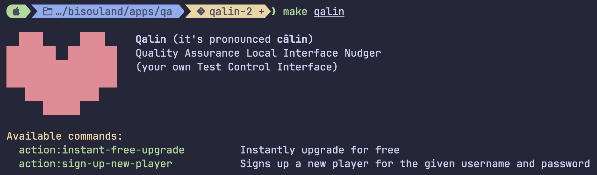
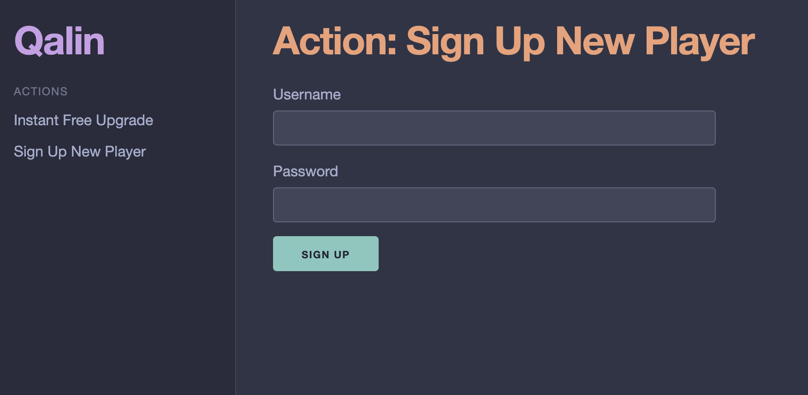

# Qalin

**Qalin** (pronounced *câlin*) stands for **Quality Assurance Local Interface Nudger**.

It is the QA application for BisouLand (`apps/qa`): a **Test Control Interface** that lets
anyone (developers, QA, designers, product) to reach any game state instantly, without
having to play the game for real to get there.

## Why it exists

Want to verify that blowing a Smooch works? To do that you need to have built one first.
To build a Smooch, you need your Mouth at level 6. Here is what each upgrade costs and
how long it takes for them to complete:

| Mouth level | Cost to next level | Completion time |
|-------------|--------------------|-----------------|
|           1 |                299 |             1 s |
|           5 |              1,478 |     22 min 28 s |

But to pay for those upgrades you need Love Points (LP). Your Heart generates LP over
time. The higher its level, the more it produces per hour:

| Heart level | LP generated / hr | Cost to next level | Completion time  |
|-------------|-------------------|--------------------|------------------|
|           1 |                14 |                150 |              1 s |
|           5 |             1,657 |                739 | 1 hr 11 min      |
|          10 |             3,019 |              5,460 | 8 hr 50 min      |

LP generation plateaus around 5,000/hr. The upgrade cost does not.<sup>*</sup>

Starting fresh with 300 LP, here is the breakdown per upgrade:

| Upgrade    |       Cost | Waiting for LP | Waiting for completion |
|:----------:|-----------:|---------------:|-----------------------:|
| Heart 1→2  |        150 |             0s |                     1s |
| Heart 2→3  |        223 |         16m 0s |                    11s |
| Heart 3→4  |        333 |        26m 45s |                 5m  0s |
| Heart 4→5  |        496 |        21m 12s |                26m 24s |
| Heart 5→6  |        739 |         7m 12s |             1h 11m     |
| Heart 6→7  |      1,103 |             0s |             2h 19m     |
| Heart 7→8  |      1,645 |             0s |             3h 44m     |
| Heart 8→9  |      2,454 |             0s |             5h 21m     |
| Heart 9→10 |      3,660 |             0s |             7h 4m      |
| Mouth 1→2  |        299 |             0s |                     1s |
| Mouth 2→3  |        446 |             0s |                     1s |
| Mouth 3→4  |        665 |             0s |                    49s |
| Mouth 4→5  |        991 |             0s |                 6m 27s |
| Mouth 5→6  |      1,478 |             0s |                22m 28s |
| **Total**  | **15,182** |     **1h 11m** |            **20h 43m** |

<sup>*</sup> Completion time assumes no Soup technique.

Nearly a day, and most of it is just watching completion timers tick.
We've spent 15,000 LP to be able to build a Smooch,
which by the way grants us 15 Score Points (SC).

Ready to blow kisses now? Well not quite.

Players aren't able to blow kisses (and be kissed) when they have under 50 SP.

The grind is not done yet.

So how do you manually test the app? Do you play for days, hoping nobody wipes the
database in the meantime?

No. You use a Test Control Interface.

Qalin lets you define **Actions** and **Scenarios** that skip the time gates, the costs,
and the prerequisites, and drop you straight into the game state that matters for your
test case.

Need Heart at level 42? `instant-free-upgrade`. Bim.
Need to verify cloud-leaping works? `UnlockLeap` scenario. Bam.
Need to check kiss blowing for early game balance? `UnlockKissBlowing` scenario. Boom.

This is why it exists. This is the power of a Test Control Interface.

## Actions and Scenarios

**Actions** are atomic operations: they invoke a single application use case directly,
bypassing game restrictions (costs, completion times, etc).

**Scenarios** are composed sequences of actions that bring the game to a specific,
meaningful state in one call, named after what they represent in the domain.

For example, the `instant-free-upgrade` Action upgrades any upgradable N levels at once,
for free, with no completion timer:

```php
<?php

declare(strict_types=1);

namespace Bl\Qa\Application\Action\InstantFreeUpgrade;

use Bl\Auth\Account\Username;
use Bl\Exception\ServerErrorException;
use Bl\Exception\ValidationFailedException;
use Bl\Game\ApplyCompletedUpgrade;
use Bl\Game\FindPlayer;
use Bl\Game\Player\UpgradableLevels\Upgradable;

final readonly class InstantFreeUpgradeHandler
{
    public function __construct(
        private ApplyCompletedUpgrade $applyCompletedUpgrade,
        private FindPlayer $findPlayer,
    ) {
    }

    public function run(InstantFreeUpgrade $input): InstantFreeUpgradeOutput
    {
        $username = Username::fromString($input->username);
        $upgradable = Upgradable::fromString($input->upgradable);
        if ($input->levels < 1) {
            throw ValidationFailedException::make(
                "Invalid \"InstantFreeUpgrade\" parameter: it should have levels >= 1 (`{$input->levels}` given)",
            );
        }

        $player = $this->findPlayer->find($username);

        for ($i = 0; $i < $input->levels; ++$i) {
            $upgradable->checkPrerequisites($player->upgradableLevels);
            $milliScore = $upgradable->computeCost($player->upgradableLevels);
            $player = $this->applyCompletedUpgrade->apply($username, $upgradable, $milliScore);
        }

        return new InstantFreeUpgradeOutput($player);
    }
}
```

And the `sign-in-new-player` Scenario signs up a brand-new player
and immediately signs them in, returning their session cookie in one call:

```php
<?php

declare(strict_types=1);

namespace Bl\Qa\Application\Scenario\SignInNewPlayer;

use Bl\Qa\Application\Action\SignInPlayer\SignInPlayer;
use Bl\Qa\Application\Action\SignInPlayer\SignInPlayerHandler;
use Bl\Qa\Application\Action\SignUpNewPlayer\SignUpNewPlayer;
use Bl\Qa\Application\Action\SignUpNewPlayer\SignUpNewPlayerHandler;

final readonly class SignInNewPlayerHandler
{
    public function __construct(
        private SignUpNewPlayerHandler $signUpNewPlayerHandler,
        private SignInPlayerHandler $signInPlayerHandler,
    ) {
    }

    public function run(SignInNewPlayer $input): SignInNewPlayerOutput
    {
        $signedUp = $this->signUpNewPlayerHandler->run(
            new SignUpNewPlayer($input->username, $input->password),
        );

        $signedIn = $this->signInPlayerHandler->run(
            new SignInPlayer($signedUp->player->account->username->toString()),
        );

        return new SignInNewPlayerOutput($signedUp, $signedIn);
    }
}
```

## Interfaces

Qalin runs alongside the app in local, dev, test, and staging environments. It is
never deployed to production.

Qalin exposes the same actions and scenarios through multiple interfaces, so everyone
can use it in the way that suits them:

* CLI
* Web
* API
* Testsuite

### CLI

For developers who live in the terminal.

```console
make qalin
make qalin arg='action:sign-up-new-player <username> <password>'
make qalin arg='action:instant-free-upgrade <username> <upgradable> [--levels=N]'
make qalin arg='scenario:sign-in-new-player <username> <password>'
```



### Web

For designers and product who prefer a browser, for example:

* http://localhost:43010/actions/sign-up-new-player
* http://localhost:43010/actions/instant-free-upgrade
* http://localhost:43010/scenarios/sign-in-new-player



### API

For bots, scripts, and HTTP clients:

```console
curl -X POST http://localhost:43010/api/v1/actions/sign-up-new-player \
     -H 'Content-Type: application/json' \
     -d '{"username": "Petrus", "password": "iLoveBlade"}'

curl -X POST http://localhost:43010/api/v1/actions/instant-free-upgrade \
     -H 'Content-Type: application/json' \
     -d '{"username": "Petrus", "upgradable": "heart", "levels": 5}'

curl -X POST http://localhost:43010/api/v1/scenarios/sign-in-new-player \
     -H 'Content-Type: application/json' \
     -d '{"username": "Petrus", "password": "iLoveBlade"}'
```

### Testsuite

For automated tests, Qalin exposes an `ActionRunner` that runs Actions directly, and a
`ScenarioRunner` that runs Scenarios directly.

Their purpose is **setting up state** with minimal boilerplate: rather than writing raw
SQL queries or curl requests, a test calls the relevant Action or Scenario through the
runner.

This applies to Smoke, End-to-End, and Integration tests. Unit and Spec tests deal with
isolated logic and have no need for Qalin Actions or Scenarios.

For example, testing log-out requires a logged-in player, set up in the Arrange section
via the `SignInNewPlayer` scenario:

```php
<?php

declare(strict_types=1);

namespace Bl\Qa\Tests\Monolith\EndToEnd;

use Bl\Auth\Tests\Fixtures\Account\PasswordPlainFixture;
use Bl\Auth\Tests\Fixtures\Account\UsernameFixture;
use Bl\Qa\Application\Scenario\SignInNewPlayer\SignInNewPlayer;
use Bl\Qa\Tests\Monolith\Infrastructure\TestKernelSingleton;
use PHPUnit\Framework\Attributes\CoversNothing;
use PHPUnit\Framework\Attributes\Large;
use PHPUnit\Framework\TestCase;

#[CoversNothing]
#[Large]
final class LogOutTest extends TestCase
{
    public function test_it_allows_players_to_log_out(): void
    {
        // Arrange
        $httpClient = TestKernelSingleton::get()->httpClient();
        $scenarioRunner = TestKernelSingleton::get()->scenarioRunner();

        $signedInNewPlayer = $scenarioRunner->run(new SignInNewPlayer(
            UsernameFixture::makeString(),
            PasswordPlainFixture::makeString(),
        ))->toArray();

        $sessionCookie = $signedInNewPlayer['cookie'];

        // Act
        $httpClient->request('GET', '/logout.html', [
            'headers' => ['Cookie' => $sessionCookie],
        ]);

        // Assert
        $response = $httpClient->request('GET', '/cerveau.html', [
            'headers' => ['Cookie' => $sessionCookie],
        ]);
        $content = $response->getContent();

        $this->assertStringContainsString("Tu n'es pas connect&eacute;.", $content);
        $this->assertSame(200, $response->getStatusCode(), $content);
    }
}
```

## Creating Actions and Scenarios

Use the MakerBundle commands to scaffold new Actions and Scenarios. Both support
interactive mode (prompts guide you through each field) or non-interactive mode
(pass all values as options, useful for scripting).

```console
make qalin-action arg='<Name>'
make qalin-scenario arg='<Name>'
```

### make:qalin:action

| Option | Short | Format | Description |
|--------|-------|--------|-------------|
| `--description` | `-d` | `"Short text"` | Shown in the CLI command help and Web page title |
| `--parameter` | `-p` | `name:type:description[:default]` | Repeatable. `type` is `string` or `int`. Omit the default to make the parameter required. |

Example:

```console
make qalin-action arg='InstantFreeUpgrade \
  -d "Instantly upgrade an upgradable for free" \
  -p "username:string:4-15 alphanumeric characters" \
  -p "upgradable:string:heart or mouth" \
  -p "levels:int:number of levels to upgrade:1"'
```

This generates 12 files under `src/` (input DTO, handler, output DTO, CLI command, Web
controller, API controller, Twig template) and `tests/` (spec tests for the DTO and
handler, integration tests for each interface).

After generation, implement the domain logic in `NameHandler.php`, fill in any `TODO`
comments, then run:

```console
cd apps/qa
make phpstan-analyze
make phpunit
```

### make:qalin:scenario

Same `--description` / `-d` and `--parameter` / `-p` options as `make:qalin:action`, plus:

| Option | Short | Format | Description |
|--------|-------|--------|-------------|
| `--action` | `-a` | `PascalCaseName` | Repeatable. Actions to compose. Must already exist; their handlers are discovered automatically and injected into the generated scenario handler. |

Example:

```console
make qalin-scenario arg='SignInNewPlayer \
  -d "Sign up and immediately sign in a brand-new player" \
  -p "username:string:4-15 alphanumeric characters" \
  -p "password:string:8-72 characters" \
  -a SignUpNewPlayer \
  -a SignInPlayer'
```

Generates the same 12 files as `make:qalin:action`, but under `Application/Scenario/` and
`UserInterface/{Cli,Web,Api}/Scenario/`. The handler is pre-wired with the discovered
action handlers as constructor dependencies.

## Inspiration

Qalin is inspired by **QAAPI**, a Test Control Interface built at Bumble Inc. and described
by Sergey Ryabko in
[API for QA: Testing features when you have no access to code](https://medium.com/bumble-tech/api-for-qa-testing-features-when-you-have-no-access-to-code-3892456aa2de)
(2021).

The core idea is the same: rather than touching the database directly or bending
production code to fit a test scenario, you expose a dedicated set of controlled
operations that anyone on the team can call: developers, QA, designers, product,
and automated tests alike.

A QAAPI method is called via HTTP:

```
/SetPromoTimeOffset?seconds=20&userid=12345
```

And returns JSON:

```json
{ "success" : true }
```

Its implementation is a self-contained class with a description, typed parameters,
and a `run()` method:

```php
<?php

class SetPromoTimeOffset extends \QAAPI\Methods\AbstractMethod
{
    public function getDescription() : string
    {
        return <<<Description
Sets a time offset in seconds between the user's registration date and the promo showing
Description;
    }

    public function getParamsConfig() : array
    {
        return [
            'user_id' => \QAAPI\Params\UserId::create(),
            'seconds' => \QAAPI\Params\PositiveInteger::create()
                ->setDescription('Offset in seconds'),
        ];
    }

    public function run() : \QAAPI\Models\Output
    {
        // logic here

        return \QAAPI\Models\Output::success();
    }
}
```

Qalin follows the same concept, with a few differences: input is a separate readonly DTO
rather than a method on the class, dependencies are injected via the constructor rather
than inherited, and the handler is wired through Symfony's service container.
