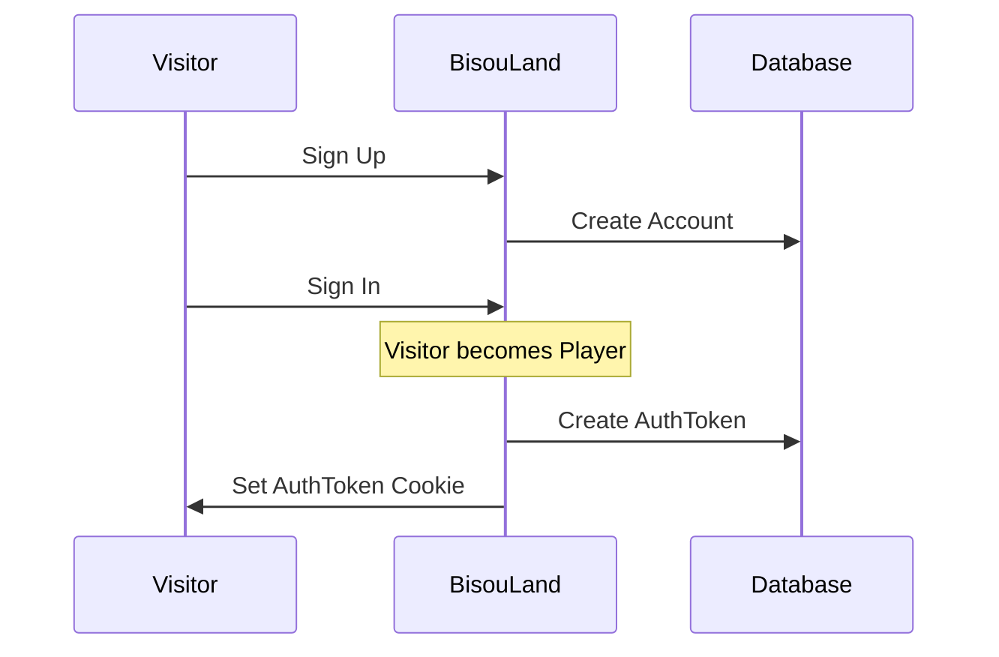

# BisouLand - Auth

Someone viewing the BisouLand pages while being unauthenticated is a **Visitor**.

A **Visitor** can **Sign Up** to create an **Account**.

After that a **Visitor** can **Sign In** and become **Player**,
an **AuthToken** will be created to keep the **Player** authenticated,
it will be stored in the database,
and set in a cookie (with **Credentials** as its value).

## Flow Diagram

## Ubiquitous Dictionary

| Term        | Type   | Definition                                                       |
|-------------|--------|------------------------------------------------------------------|
| Visitor     | Actor  | Someone viewing BisouLand pages while unauthenticated            |
| Player      | Actor  | Someone viewing BisouLand pages while authenticated              |
| Sign Up     | Action | The process by which a Visitor creates an Account                |
| Sign In     | Action | The process by which a Player authenticates                      |
| Account     | Model  | The strict minimum information allowing a Player to authenticate |
| AuthToken   | Model  | Temporary proof of authentication                                |
| Credentials | Model  | The Cookie value containing AuthTokenId and TokenPlain           |

## Authentication Explained

Following the recommendations from [Secure Authentication with long term persistence](https://paragonie.com/blog/2015/04/secure-authentication-php-with-long-term-persistence),
once a Player Signs In, we create an **AuthToken**:

* **AuthTokenId**: the identifier and "selector" for the **AuthToken**
* **TokenPlain**: the "validator" stored in the Cookie
* **TokenHash**: a SHA-256 hash of the **TokenPlain** stored in the Database
* **AccountId**: the identifier for the **Account**
* **ExpiresAt**: the expiration date stored both in the Database and the Cookie

It is stored in the database (`auth_token` table),
and set in a cookie:

* cookie name: `bl_auth_token`
* cookie value: **Credentials** which is `auth_token_id:token_plain`
* cookie expires: **ExpiresAt** in UNIX timestamp format

When a **Player** is viewing a BisouLand page, we check the `bl_auth_token` **Cookie**:

1. Check if the **AuthTokenId** can be found in the `auth_token` table
   (making sure **ExpiresAt** hasn't been reached).
   If not, throw a `401 UNAUTHORIZED`.
2. Check if the **TokenPlain** is equal to **TokenHash**
   (hashing **TokenPlain** with SHA-256 and using `hash_equals()`).
   If not, throw a `401 UNAUTHORIZED`.
3. If all passed, **Player** is Signed In.

## Classes

### Account

- `Bl\Auth\Account`: Entity (AccountId + Username + PasswordHash)
- `Bl\Auth\Account\AccountId`: ValueObject (UUID v7)
- `Bl\Auth\Account\Username`: ValueObject (4-15 chars, alphanumeric + underscore)
- `Bl\Auth\Account\PasswordHash`: ValueObject (bcrypt hash)
- `Bl\Auth\Account\PasswordPlain`: ValueObject (min 8 chars, NIST SP 800-63B Rev 4)

### AuthToken

- `Bl\Auth\AuthToken`: Entity (AuthTokenId + TokenHash + AccountId + ExpiresAt)
- `Bl\Auth\AuthToken\AuthTokenId`: ValueObject (UUID v7)
- `Bl\Auth\AuthToken\TokenPlain`: ValueObject (32 hex chars, generated with `random_bytes`)
- `Bl\Auth\AuthToken\TokenHash`: ValueObject (SHA-256 hash of TokenPlain)
- `Bl\Auth\AuthToken\ExpiresAt`: ValueObject (ISO 8601 date, default +15 days)
- `Bl\Auth\SaveAuthToken`: Service interface
- `Bl\Auth\DeleteAuthToken`: Service interface

### AuthTokenCookie

- `Bl\Auth\AuthTokenCookie\Credentials`: ValueObject (`auth_token_id:token_plain`, cookie name `bl_auth_token`)
